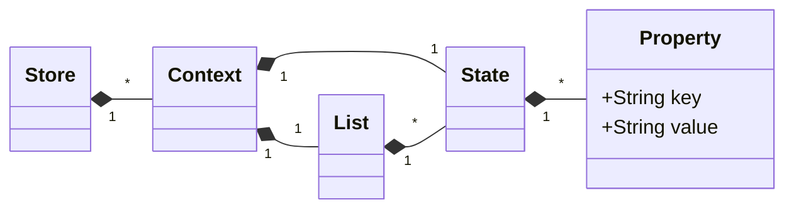

# WireMock State extension

Adds support to transport state across different stubs.

## Feature summary

- Store a state for a context
    - overwrite states
    - append new states a state list
- Delete a state
    - delete states from state list (first, last, by index, by state propery comparison)
- request matching against context existance/non-existance
- response templating integration
    - get state for a given context
    - get state list entry by index
- templating support in all configuration options of this extension

## Glossary

| Term       | Description                                                                                                                                     |
|------------|-------------------------------------------------------------------------------------------------------------------------------------------------|
| `context`  | States are scoped by a context. Behavior is similar to a key in a map.                                                                          |
| `state`    | The actual state. There can be only one per context - but it can be overwritten.                                                                |
| `property` | A property of a `state`. A state can have multiple properties.                                                                                  |
| `list`     | Next to the singularic state, a context can have a list of `states`. The list of `states` can be modified but `states` within the `list` can't. |



## Background

Wiremock supports [Response Templating](https://wiremock.org/docs/response-templating/) and [Scenarios](https://wiremock.org/docs/stateful-behaviour/)
to add dynamic behavior and state. Both approaches have limitations:

- `Response templating` only allows accessing data submitted in the same request
- `Scenarios` cannot transport any data other than the state value itself

In order to mock more complex scenarios which are similar to a sandbox for a web service, it can be required to use parts of a previous request.

## Example use cases

Create a sandbox for a webservice. The web service has two APIs:

### CRUD

1. `POST` to create a new identity (`POST /identity`)
    - Request:
   ```json
   {
    "firstName": "John",
    "lastName": "Doe"
   }
    ```
    - Response:
   ```json
    {
      "id": "kn0ixsaswzrzcfzriytrdupnjnxor1is", # Random value
      "firstName": "John",
      "lastName": "Doe" 
   }
    ```
2. `GET` to retrieve this value (`GET /identity/kn0ixsaswzrzcfzriytrdupnjnxor1is`)

- Response:

  ```json
    {
      "id": "kn0ixsaswzrzcfzriytrdupnjnxor1is",
      "firstName": "John",
      "lastName": "Doe"
    }
  ```

The sandbox should have no knowledge of the data that is inserted. While the `POST` can be achieved
with [Response Templating](https://wiremock.org/docs/response-templating/),
the `GET` won't have any knowledge of the previous post.

### Queue

1. `POST` add a new item (`POST /queue`)
    - Request:
   ```json
   {
    "firstName": "John",
    "lastName": "Doe"
   }
    ```
    - Response:
   ```json
    {
      "id": "kn0ixsaswzrzcfzriytrdupnjnxor1is", # Random value
      "firstName": "John",
      "lastName": "Doe" 
   }
    ```

2`POST` add another new item (`POST /queue`)
- Request:

   ```json
   {
  "firstName": "Jane",
  "lastName": "Doe"
}
   ```

- Response:

   ```json
    {
  "id": "54owywgurlqepq1wc5xvyc2hipe8xp4u",
  #
  Random
  value
  "firstName": "Jane",
  "lastName": "Doe"
}
   ```

3. `GET` to retrieve the first value (`GET /queue`)

- Response:

  ```json
    {
  "id": "kn0ixsaswzrzcfzriytrdupnjnxor1is",
  "firstName": "John",
  "lastName": "Doe"
}
  ```

4. `GET` to retrieve the second value (`GET /queue`)

- Response:

  ```json
    {
  "id": "54owywgurlqepq1wc5xvyc2hipe8xp4u",
  "firstName": "Jane",
  "lastName": "Doe"
}
  ```

# Usage

## Compatibility matrix

| `wiremock-extension-state` version | `WireMock` version |
|------------------------------------|--------------------|
| `0.0.3`+                           | `3.0.0-beta-11`+   |

## Installation

### Gradle

```groovy
repositories {
    maven {
        url = uri("https://maven.pkg.github.com/wiremock/wiremock-extension-state")
    }
}


dependencies {
    testImplementation("org.wiremock:wiremock-state-extension:<your-version>")
}
```

### Maven

Follow the instructions on [GitHub Docs](https://docs.github.com/en/packages/working-with-a-github-packages-registry/working-with-the-apache-maven-registry) to
add authentication to GitHub packages.

```xml

<repositories>
    <repository>
        <id>github-wiremock-extension-state</id>
        <name>WireMock Extension State Apache Maven Packages</name>
        <url>https://maven.pkg.github.com/wiremock/wiremock-extension-state</url>
    </repository>
</repositories>

<dependencies>
<dependency>
    <groupId>org.wiremock</groupId>
    <artifactId>wiremock-state-extension</artifactId>
    <version>your-version</version>
    <scope>test</scope>
</dependency>
</dependencies>
```

## Register extension

### Java

This extension makes use of Wiremock's `ExtensionFactory`, so only one extension has to be registered: `StateExtension`.
In order to use them, templating has to be enabled as well. A store for all state data has to be provided. This extension
provides a `CaffeineStore` which can be used - or you can provide your own store:

```java
public class MySandbox {
    private final WireMockServer server;

    public MySandbox() {
        var stateRecordingAction = new StateRecordingAction();
        var store = new CaffeineStore();
        server = new WireMockServer(
            options()
                .dynamicPort()
                .templatingEnabled(true)
                .globalTemplating(true)
                .extensions(new StateExtension(store))
        );
        server.start();
    }
}
```

### Standalone

This extension uses the `ServiceLoader` extension to be loaded by WireMock. As Standalone version, it will use `CaffeineStore` for
storing any data.

The standalone jar can be downloaded from [GitHub](https://github.com/wiremock/wiremock-extension-state/packages/1902576) .

```bash
java -cp "wiremock-state-extension-standalone-0.0.5.jar:wiremock-standalone-3.0.0-beta-11.jar" wiremock.Run
```

### Docker

Using the extension with docker is similar to its usage with usage [standalone](#standalone): it just has to be available on 
the classpath to be loaded automatically - it does not have to be added via `--extensions` .

**Note:** This extension depends on the current WireMock beta development, thus the tag `3x` has to be used:


```bash
docker run -it --rm \
-p 8080:8080 \
--name wiremock \
-v $PWD/extensions:/var/wiremock/extensions \
wiremock/wiremock:3x
```

## Record a state

The state is recorded in `serveEventListeners` of a stub. The following functionalities are provided:

- `state` : stores a state in a context. Storing the state multiple times can be used to selectively overwrite existing properties.
- `list` : stores a state in a list. Can be used to prepend/append new states to an existing list. List elements cannot be modified (only read/deleted).

`state` and `list` can be used in the same `ServeEventListener` (would count as two updates). Adding multiple `recordState` `ServeEventListener` is supported.

The following parameters have to be provided:

<table>
<tr>
<th>Parameter</th>
<th>Type</th>
<th>Example</th>
</tr>
<tr>
<td>

`context`

</td>
<td>String</td>
<td>

- `"context": "{{jsonPath response.body '$.id'}}"`
- `"context": "{{request.pathSegments.[3]}}"`

</td>
</tr>
<tr>
<td>

`state`

</td>
<td>Object</td>
<td>

```json
  {
  "id": "{{jsonPath response.body '$.id'}}",
  "firstName": "{{jsonPath request.body '$.firstName'}}",
  "lastName": "{{jsonPath request.body '$.lastName'}}"
}
  ```

</td>
</tr>
<tr>
<td>

`list`

</td>
<td>
Dictionary

- `addLast` : Adds the object to the end of the list
- `addFirst` : Adds the object to the front of the list

</td>
<td>

```json
  {
  "addLast": {
    "id": "{{jsonPath response.body '$.id'}}",
    "firstName": "{{jsonPath request.body '$.firstName'}}",
    "lastName": "{{jsonPath request.body '$.lastName'}}"
  }
}
  ```

</td>
</tr>
</table>

Templating (as in [Response Templating](https://wiremock.org/docs/response-templating/)) is supported for these. The following models are exposed:

- `request`: All model elements of as in [Response Templating](https://wiremock.org/docs/response-templating/)
- `response`: `body` and `headers`

Full example for storing a state:

```json
{
  "request": {},
  "response": {},
  "serveEventListeners": [
    {
      "name": "recordState",
      "parameters": {
        "context": "{{jsonPath response.body '$.id'}}",
        "state": {
          "id": "{{jsonPath response.body '$.id'}}",
          "firstName": "{{jsonPath request.body '$.firstName'}}",
          "lastName": "{{jsonPath request.body '$.lastName'}}"
        }
      }
    }
  ]
}
```

To record a complete response body, use:

```json
{
  "request": {},
  "response": {},
  "serveEventListeners": [
    {
      "name": "recordState",
      "parameters": {
        "context": "{{jsonPath response.body '$.id'}}",
        "state": {
          "fullBody": "{{jsonPath response.body '$'}}"
        }
      }
    }
  ]
}
```

To append a state to a list:

```json
{
  "request": {},
  "response": {},
  "serveEventListeners": [
    {
      "name": "recordState",
      "parameters": {
        "context": "{{jsonPath response.body '$.id'}}",
        "list": {
          "addLast": {
            "id": "{{jsonPath response.body '$.id'}}",
            "firstName": "{{jsonPath request.body '$.firstName'}}",
            "lastName": "{{jsonPath request.body '$.lastName'}}"
          }
        }
      }
    }
  ]
}
```

### Accessing the previous state

You can use the `state` helper to temporarily access the previous state. Use the `state` helper in the same way as you would use it when you [retrieve a state](#retrieve-a-state).

**Note:** This extension does not keep a history in itself but it's an effect of the evaluation order.
As templates are evaluated before the state is written, the state you access in `recordState` is the one before you store the new one
(so there might be none - you might want to use `default` for these cases). In case you have multiple `recordState` `serveEventListeners`, you will have new states
being created in between, thus the previous state is the last stored one (so: not the one before the request).

1. listener 1 is executed
   1. accesses state n
   2. stores state n+1
2. listener 2 is executed
    1. accesses state n+1
    2. stores state n+2

The evaluation order of listeners within a stub as well as across stubs is not guaranteed.

```json
{
  "request": {},
  "response": {},
  "serveEventListeners": [
    {
      "name": "recordState",
      "parameters": {
        "context": "{{jsonPath response.body '$.id'}}",
        "state": {
          "id": "{{jsonPath response.body '$.id'}}",
          "firstName": "{{jsonPath request.body '$.firstName'}}",
          "lastName": "{{jsonPath request.body '$.lastName'}}",
          "birthName": "{{state context='$.id' property='lastName' default=''}}"
        }
      }
    }
  ]
}
```


## Deleting a state

Similar to recording a state, its deletion can be initiated in  `serveEventListeners` of a stub.

The following parameters have to be provided:

<table>
<tr>
<th>Parameter</th>
<th>Type</th>
<th>Example</th>
</tr>
<tr>
<td>

`context`

</td>
<td>String</td>
<td>

- `"context": "{{jsonPath response.body '$.id'}}"`
- `"context": "{{request.pathSegments.[3]}}"`

</td>
</tr>
<tr>
<td>

`list` (Optional) <br>
When list is provided, only the specified list element is deleted. If `list` is not provided, the whole context is deleted.

</td>
<td>
Dictionary - only one option is interpreted (top to bottom as listed here)

- `deleteFirst` (Boolean) - deletes first element in the list
- `deleteLast` (Boolean) - deletes last element in the list
- `deleteIndex` (Number as String) - deletes element at index (starting with `0` - last element = `-1`).
  Number has to be represented as String. Supports templating.
- `deleteWhere` (Object with `property` and `value`) - Deletes first element matching the condition.
  Both `property` and `value` support templating.

</td>
<td>

- ```json
  { 
    "name": "deleteState",
    "list": {
      "deleteFirst": true
    }
  }
  ```
- ```json
  { 
    "name": "deleteState",
    "list": {
      "deleteLast": true
    }
  }
  ```
- ```json
  { 
    "name": "deleteState",
    "list": {
      "deleteIndex": "1"
    }
  }
  ```
- ```json
  { 
    "name": "deleteState",
    "list": {
      "deleteIndex": "-1"
    }
  }
  ```
- ```json
  { 
    "name": "deleteState",
    "list": {
      "deleteIndex": "{{request.pathSegments.[1]}}"
    }
  }
  ```
- ```json
  { 
    "name": "deleteState",
    "list": {
      "deleteWhere": {
        "property": "myProperty",
        "value": "{{request.pathSegments.[2]}}"
      }
    }
  }
  ```

</td>
</tr>
</table>

Templating (as in [Response Templating](https://wiremock.org/docs/response-templating/)) is supported for these. The following models are exposed:

- `request`: All model elements of as in [Response Templating](https://wiremock.org/docs/response-templating/)
- `response`: `body` and `headers`

Full example:

```json
{
  "request": {},
  "response": {},
  "serveEventListeners": [
    {
      "name": "deleteState",
      "parameters": {
        "context": "{{jsonPath response.body '$.id'}}"
      }
    }
  ]
}

```

### state expiration

This extension provides a `CaffeineStore` which uses [caffeine](https://github.com/ben-manes/caffeine) to store the current state and to achieve an expiration (
to avoid memory leaks).
The default expiration is 60 minutes. The default value can be overwritten (`0` = default = 60 minutes):

```java
int expiration=1024;
    var store=new CaffeineStore(expiration);
```

## Match a request against a context

To have a WireMock stub only apply when there's actually a matching context, you can use the `StateRequestMatcher` . This helps to model different
behavior for requests with and without a matching context. The parameter supports templates.

### Positive context exists match

```json
{
  "request": {
    "method": "GET",
    "urlPattern": "/test/[^\/]+",
    "customMatcher": {
      "name": "state-matcher",
      "parameters": {
        "hasContext": "{{request.pathSegments.[1]}}"
      }
    }
  },
  "response": {
    "status": 200
  }
}
```

### Context update count match

Whenever the serve event listener `recordState` is processed, the internal context update counter is increased. The number can be used
for request matching as well. The following matchers are available:

- `updateCountEqualTo`
- `updateCountLessThan`
- `updateCountMoreThan`

As for other matchers, templating is supported.

```json
{
  "request": {
    "method": "GET",
    "urlPattern": "/test/[^\/]+",
    "customMatcher": {
      "name": "state-matcher",
      "parameters": {
        "hasContext": "{{request.pathSegments.[1]}}",
        "updateCountEqualTo": "1"
      }
    }
  },
  "response": {
    "status": 200
  }
}
```

### List size match

The list size (which is modified via `recordState` or `deleteState`)  can be used
for request matching as well. The following matchers are available:

- `listSizeEqualTo`
- `listSizeLessThan`
- `listSizeMoreThan`

As for other matchers, templating is supported.

```json
{
  "request": {
    "method": "GET",
    "urlPattern": "/test/[^\/]+",
    "customMatcher": {
      "name": "state-matcher",
      "parameters": {
        "hasContext": "{{request.pathSegments.[1]}}",
        "listSizeEqualTo": "1"
      }
    }
  },
  "response": {
    "status": 200
  }
}
```

### Negative context exists match

```json
{
  "request": {
    "method": "GET",
    "urlPattern": "/test/[^\/]+",
    "customMatcher": {
      "name": "state-matcher",
      "parameters": {
        "hasNotContext": "{{request.pathSegments.[1]}}"
      }
    }
  },
  "response": {
    "status": 400
  }
}
```

## Retrieve a state

A state can be retrieved using a handlebar helper. In the example above, the `StateHelper` is registered by the name `state`.
In a `jsonBody`, the state can be retrieved via: `"clientId": "{{state context=request.pathSegments.[1] property='firstname'}}",`

The handler has the following parameters:

- `context`:  has to match the context data was registered with
- `property`: the property of the state context to retrieve, so e.g. `firstName`
    - `property='updateCount` retrieves the number of updates to a certain state.
      The number matches the one described in [Context update count match](#context-update-count-match)
    - `property='listSize` retrieves the number of entries of `list`
- `list`: Getting an entry of the context's `list`, identified via a JSON path. Examples:
    - getting the first state in the list: `list='[0].myProperty`
    - getting the last state in the list: `list='[-1].myProperty`
    - getting an element based on a path segment:: `list=(join '[' request.pathSegments.[1] '].myProperty' '')`
- `default` (Optional): value to return in case the context or property wasn't found. Without a default value, an error message would be returned instead.

You have to choose either `property` or `list` (otherwise, you will get a configuration error).

To retrieve a full body, use: `{{{state context=request.pathSegments.[1] property='fullBody'}}}` .

When registering this extension, this helper is available via  WireMock's [response templating](https://wiremock.org/3.x/docs/response-templating/) as well as 
in all configuration options of this extension.

### Error handling

Missing Helper properties as well as unknown context properties are reported as error. Wiremock renders them in the field, itself, so there won't be an
exception.

Example response with error:

```json
{
  "id": "kn0ixsaswzrzcfzriytrdupnjnxor1is",
  "firstName": "[ERROR: No state for context kn0ixsaswzrzcfzriytrdupnjnxor1is, property firstName found]",
  "lastName": "Doe"
}
```

To avoid errors, you can specify a `default` for the state helper: `"clientId": "{{state context=request.pathSegments.[1] property='firstname' default='John'}}",`

# Debugging

- EventListeners and Matchers report errors with WireMock-internal exceptions. Additionally, errors are logged.
  In order to see them, [register a notifier](https://wiremock.org/3.x/docs/configuration/#notification-logging).
- Response templating errors are printed in the actual response body. To see the body,
  either [register a notifier](https://wiremock.org/3.x/docs/configuration/#notification-logging) with `verbose` turned on or
  print the responses in your client application.

# Examples

Various test examples can be found in the [tests](src/test/java/org/wiremock/extensions/state/examples) of this extension.

JSON stub mapping can be found in the resource files of the [tests](src/test/resources) .
